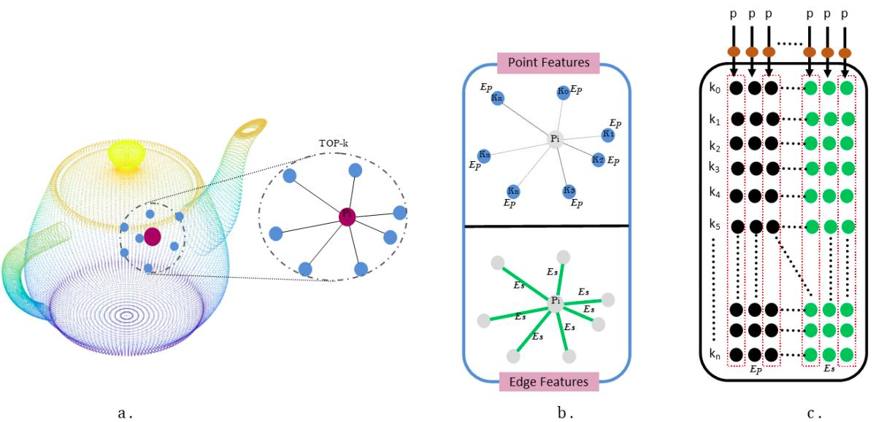

# DC-GNN: Drop Channel Graph Neural Network for Classification and Part Segmentation in Point Cloud.

Created by -----> Md Meraz, Md Afzal Ansari, Mohammed Javed, and Pavan Chakraborty

## Release

Souce code is Publicly available in November First weak.

## How to use Code
Requirements

- Python 3.7 
- Pytorch 1.7
- Cuda 9.2
- scikit learn, HD5

---
## Point Cloud Classification
--------------------
### Training

### Evaluation

### Performance:
**ModelNet-40 dataset**

|  | Overall Acc | 
| :---: | :---: | 
| Paper (1024 points) | 93.64 |

---
## Point Cloud Part-Segmentation
--------------------
### Training

### Evaluation

### Performance:
**ShapeNet part dataset**

| | Mean IoU | Airplane | Bag | Cap | Car | Chair | Earphone | Guitar | Knife | Lamp | Laptop | Motor | Mug | Pistol | Rocket | Skateboard | Table
| :---: | :---: | :---: | :---: | :---: | :---: | :---: | :---: | :---: | :---: | :---: | :---: | :---: | :---: | :---: | :---: | :---: | :---: | 
| #Shapes | | 2690 | 76 | 55 | 898 | 3758 | 69 | 787 | 392 | 1547 | 451 | 202 | 184 | 283 | 66 | 152 | 5271 | 
| Papers | 84.55 | 85.3 | 82.29 | 86.09 | 81.0 | 91.39 | 78.97 | 92.2 | 88.07 | 85.02 | 95.82 | 72.83 | 95.2 | 84.53 | 54.28 | 76.99 | 82.97

---
## Citation 
---